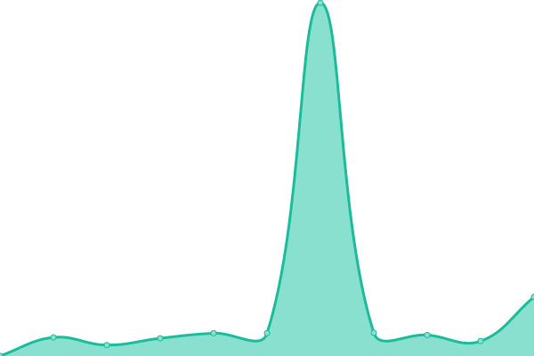
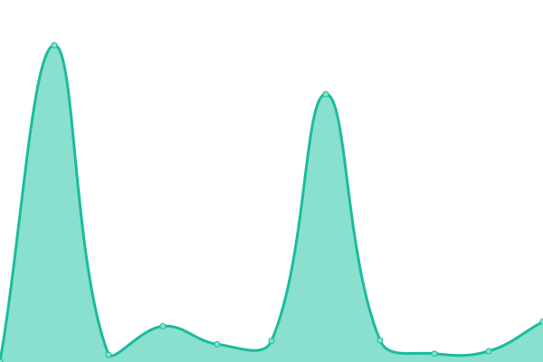
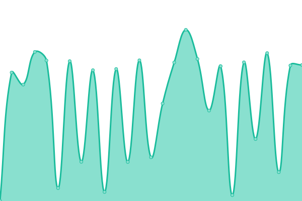

# [📈 Live Status](https://RivetWork.github.io/uptime): <!--live status--> **🟩 All systems operational**

This repository contains the open-source uptime monitor and status page for [Rivet Work Inc](https://www.rivet.work), powered by [Upptime](https://github.com/upptime/upptime).

With [Upptime](https://upptime.js.org), you can get your own unlimited and free uptime monitor and status page, powered entirely by a GitHub repository. We use [Issues](https://github.com/RivetWork/uptime/issues) as incident reports, [Actions](https://github.com/RivetWork/uptime/actions) as uptime monitors, and [Pages](https://RivetWork.github.io/uptime) for the status page.

<!--start: status pages-->
<!-- This summary is generated by Upptime (https://github.com/upptime/upptime) -->
<!-- Do not edit this manually, your changes will be overwritten -->
<!-- prettier-ignore -->
| URL | Status | History | Response Time | Uptime |
| --- | ------ | ------- | ------------- | ------ |
|  [Data Agents](https://agent.rivet.work/ping) | 🟩 Up | [data-agents.yml](https://github.com/RivetWork/uptime/commits/HEAD/history/data-agents.yml) | 

 940ms
     
 | 

<a href="https://https://friendly-adventure-738lml2.pages.github.io/history/data-agents">100.00%</a>
    

|  [ETL](https://etl.rivet.work/ping) | 🟩 Up | [etl.yml](https://github.com/RivetWork/uptime/commits/HEAD/history/etl.yml) | 

 1841ms
     
 | 

<a href="https://https://friendly-adventure-738lml2.pages.github.io/history/etl">100.00%</a>
    

|  [Integrations Test](https://integration-test.api.rivet.work/ping) | 🟩 Up | [integrations-test.yml](https://github.com/RivetWork/uptime/commits/HEAD/history/integrations-test.yml) | 

 608ms
     
 | 

<a href="https://https://friendly-adventure-738lml2.pages.github.io/history/integrations-test">98.61%</a>
    

|  [Rivet App](https://app.rivet.work) | 🟩 Up | [rivet-app.yml](https://github.com/RivetWork/uptime/commits/HEAD/history/rivet-app.yml) | 

 313ms
     
 | 

<a href="https://https://friendly-adventure-738lml2.pages.github.io/history/rivet-app">100.00%</a>
    

|  [Rivet API](https://api.rivet.work/ping) | 🟩 Up | [rivet-api.yml](https://github.com/RivetWork/uptime/commits/HEAD/history/rivet-api.yml) | 

 570ms
     
 | 

<a href="https://https://friendly-adventure-738lml2.pages.github.io/history/rivet-api">100.00%</a>
    

|  [Marketing site](https://rivet.work) | 🟩 Up | [marketing-site.yml](https://github.com/RivetWork/uptime/commits/HEAD/history/marketing-site.yml) | 

 636ms
     
 | 

<a href="https://https://friendly-adventure-738lml2.pages.github.io/history/marketing-site">100.00%</a>
    

|  [URL Shortener](https://rivt.cc/ping) | 🟩 Up | [url-shortener.yml](https://github.com/RivetWork/uptime/commits/HEAD/history/url-shortener.yml) | 

 212ms
     
 | 

<a href="https://https://friendly-adventure-738lml2.pages.github.io/history/url-shortener">100.00%</a>
    

<!--end: status pages-->

[**Visit our status website →**](https://RivetWork.github.io/uptime)

## 📄 License

- Powered by: [Upptime](https://github.com/upptime/upptime)
- Code: [MIT](./LICENSE) © [Anand Chowdhary](https://anandchowdhary.com), supported by [Pabio](https://pabio.com)
- Data in the `./history` directory: [Open Database License](https://opendatacommons.org/licenses/odbl/1-0/)
